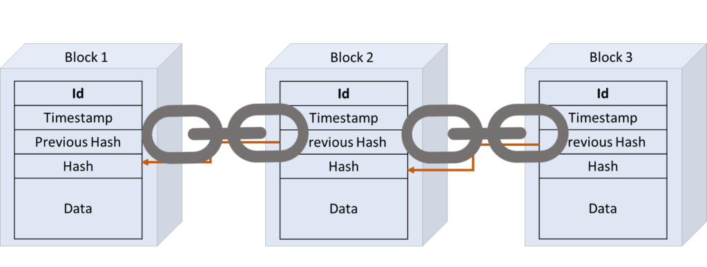
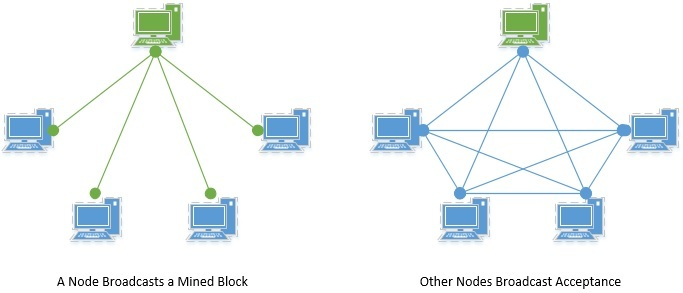

# BlockChain Implementation with Java.
In this project, we will demonstrate the power of the Blockchain by implementing simple decentralized  Blockchain in Java.

## What Is A Blockchain ?
A blockchain is a distributed database that is shared among the nodes of a computer network.
they are blocks (List<Block>) of data connected through the use of cryptography. 
It belongs to a network of nodes connected over the public/private network
As a database, a blockchain stores information electronically in digital format.

## Mining a Block
We represent a block by a hash value. Generating the hash value of a block is called “mining” the block. Mining a block is typically computationally expensive to do as it serves as the “proof of work”.

The hash of a block typically consists of the following data:

* Primarily, the hash of a block consists of the transactions it encapsulates
* The hash also consists of the timestamp of the block's creation
* It also includes a nonce, an arbitrary number used in cryptography
* Finally, the hash of the current block also includes the hash of the previous block

Multiple nodes in the network can compete to mine the block at the same time. 
Apart from generating the hash, nodes also have to verify that the transactions being added in the block are legitimate. 
**The first to mine a block wins the race**!

## Adding a Block into Blockchain

While mining a block is computationally expensive, verifying that a block is legitimate is relatively much easier. 
All nodes in the network participate in verifying a newly mined block.

Thus, a newly mined block is added into the blockchain on the consensus of the nodes.

Now, there are several consensus protocols available which we can use for verification. 
The nodes in the network use the same protocol to detect malicious branch of the chain. 
Hence, a malicious branch even if introduced will soon be rejected by the majority of the nodes.

## Alternate Consensus Protocol
We saw that consensus algorithm like “Proof of Work” is used to mine and validate a block. However, 
this is not the only consensus algorithm available for use.

There are **several other consensus algorithms to choose from**, like Proof of Stake, Proof of Authority, and Proof of Weight.
All of these have their pros and cons.
Which one to use depends upon the type of application we intend to design.

## Mining Reward
A blockchain network typically consists of voluntary nodes. Now, why would anyone want to contribute to this complex 
process and keep it legit and growing?

This is because nodes are rewarded for verifying the transactions and mining a block. These rewards are typically 
in the form of coin associated with the application. But an application can decide the reward to be anything of value.

## Node Types
A blockchain completely relies on its network to operate. In theory, the network is completely decentralized, 
and every node is equal. However, in practice, a network consists of multiple types of nodes.

While a full node has a complete list of transactions, a light node only has a partial list. Moreover, 
not all nodes participate in verification and validation.

## Secure Communication
One of the hallmarks of blockchain technology is its openness and anonymity. But how does it provide security 
to transactions being carried within? This is based on cryptography and public key infrastructure.

The initiator of a transaction uses their private key to secure it and attach it to the public key of the recipient. 
Nodes can use the public keys of the participants to verify transactions.

## How to use this code ? 
1. Open the folder as project in InteliJ.
2. Change all database connections filepaths to your local machine.
3. Run.
If you want to run multiple peers: 
1. Copy Paste the same folder and open the multiple folders in Intelij in paralel
2. Make sure they don't share database connection filepaths.
3. Change local peer port and peer client ports for each copy accordingly. (They are hard coded in the code)

